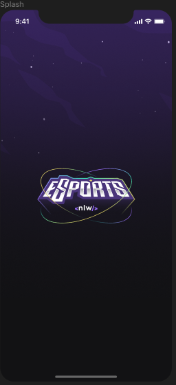
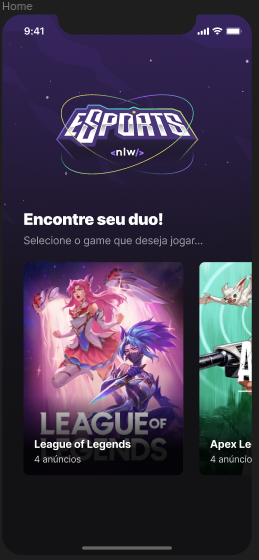
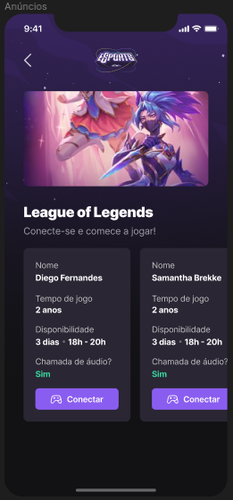
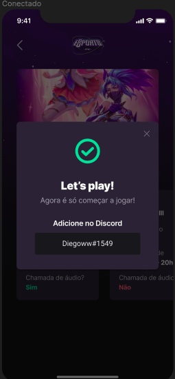
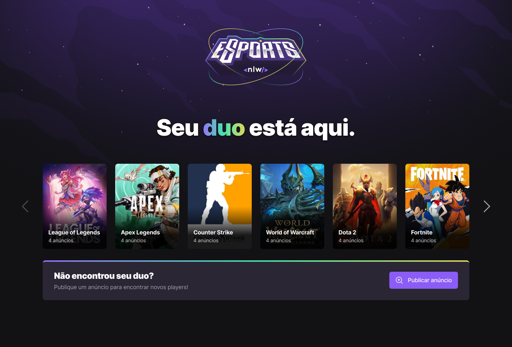

<h1 align="center">
    Esports
</h1>

<h3 align="center">

Esports é um projeto **Open Source** desenvolvido na semana **Next Level Week ** da **[Rocketseat][rocketseat_site]** utilizando as tecnologias ***TypeScript, Node, React, React Native, Expo e Tailwind***.

</h3>

<p align="center">
  
  
  
  
</p>

<p align="center">
  
  
</p>

## **:rocket: OBJETIVO**

O projeto permite os usuários a buscarem sua dupla em jogos online e publicar um anúncio para encontrar outros jogadores no jogo que desejar. Na versão mobile, são exibidos os anúncios dos jogadores para os jogos cadastrados e os usuários terão a possibilidade de se conectarem para jogarem juntos.

<!-- 
  ...
  Local Reservado para o GIF do projeto rodando.
  ...
-->

## **:computer: TECNOLOGIAS**


#### **Website** ([React][react] + [TypeScript][typescript])

  - **[Axios][axios]**

  \* Veja o arquivo <kbd>[package.json](./sources/website/package.json)</kbd>

#### **Server** ([NodeJS][node] + [TypeScript][typescript])

  - **[Express][express]**
  - **[CORS][cors]**
  - **[SQLite][sqlite3]**
  - **[ts-node][tsnode]**

  \* Veja o arquivo <kbd>[package.json](./sources/server/package.json)</kbd>

#### **Mobile** ([React Native][react_native] + [TypeScript][typescript])

  - **[Expo][expo]**
  - **[Expo Google Fonts][expo_google_fonts]**
  - **[React Navigation][react_navigation]**
  - **[Expo Constants][expo_constants]**
  - **[React Native SVG][react_native_svg]**
  - **[Axios][axios]**

  \* Veja o arquivo <kbd>[package.json](./sources/mobile/package.json)</kbd>

#### **Utilitários**

- Protótipo: **[Figma](https://www.figma.com/)** &rarr; **<kbd>[Protótipo (Esports)](https://www.figma.com/file/CHhEgW1C8f953wehOUQjvp/NLW-eSports-(Community)?node-id=6%3A23)</kbd>**
- Editor: **[Visual Studio Code][vscode]** &rarr; Extensions: **<kbd>[SQLite][vscode_sqlite_extension]</kbd>**
- Teste de API: **[Insomnia][insomnia]**

## **:wine_glass: COMO UTILIZAR**

### Configurações Iniciais

Primeiro, você precisa ter o <kbd>[NodeJS](https://nodejs.org/en/download/)</kbd> instalado na sua máquina. 

Se você estiver utilizando o **Linux**, você pode optar por instalar o **Node** através do gerênciador de versões <kbd>[asdf]</kbd> para facilitar o processo de mudança da versão do **Node**, quando for necessário.

Você pode optar também por utilizar o **yarn** no lugar do **npm**. Você pode instalar clicando nesse <kbd>[link][yarn]</kbd>, ou através do <kbd>[asdf]</kbd>.

Após ter o **Node** instalado, instale as dependências do **React e React Native (Expo)** de forma global, utilizando os comandos:

```sh
# React:
$ npm install create-react-app -g

# Expo (React Native):
$ npm install -g expo-cli 
```

Instale as dependências contidas nos arquivos `package.json` que se encontram na raíz do repositório (para o gerenciamento de commits), no diretório do **server**, no diretório do **web** e no diretório **mobile**. Para instalar as dependências, basta abrir o terminal no diretório e digitar o comando:

```sh
$ npm install

# ou
$ yarn
```

Exemplos:
```sh

# Instalando as dependências do server:
$ cd server
$ npm install

# Instalando as dependências do web:
$ cd web
$ npm install

# Instalando as dependências do mobile:
$ cd mobile
$ npm install
```

Veja os arquivos **`package.json`** do <kbd>[server](/server/package.json)</kbd>, <kbd>[website](/web/package.json)</kbd> e <kbd>[mobile](/mobile/package.json)</kbd>.

### Utilizando o Server

```sh
# Abrindo o terminal no diretório do servidor:
$ cd /server

# Executando a aplicação em modo de desenvolvimento:
$ npm run dev
```

> Veja a parte de **scripts {}** do arquivo <kbd>[package.json](/server/package.json)</kbd> para saber quais scripts estão disponíveis.

### Utilizando o Web

```sh
# Abrindo o terminal no diretório do website:
$ cd /web

# Executando o website no modo de desenvolvimento:
$ npm run dev
```

> Se o browser não abrir automaticamente, acesse: http://localhost:3333.

### Utilizando o Mobile

Instale o aplicativo <kbd>[Expo](https://play.google.com/store/apps/details?id=host.exp.exponent&hl=en)</kbd> no seu smartphone.

```sh
# Abrindo o terminal no diretório do mobile:
$ cd /mobile

# Executando o mobile no modo de desenvolvimento:
$ npm run android
ou
$ expo start
```

Agora, abra o aplicativo do expo e no modo **LAN** faça o scan do QRCode.

> Se tiver algum problema para executar o aplicativo nesse modo, tente desabilitar o firewall da sua máquina.

Se tiver algum problema com as fontes, utilize o comando:
```sh
$ expo install expo-font @expo-google-fonts/ubuntu @expo-google-fonts/roboto
```

**\* Lembre de inserir nos arquivos `src/screens/Game/index.tsx | src/screens/Home/index.tsx` o IP exato que foi gerado pelo seu mobile após utilizar o comando `npm run start`.**

## **:star2: AGRADECIMENTOS**

<div align=center>

<table style="width:100%">
  <tr align=center>
    <th><strong>Next Level Week</strong></th>
    <th><strong>Rocketseat</strong></th>
    <th><strong>diego3g</strong></th>
    <th><strong>maykbrito</strong></th>
  </tr>
  <tr align=center>
    <td>
      <a href="https://nextlevelweek.com/">
        
      </a>
    </td>
    <td>
      <a href="https://rocketseat.com.br/">
        
      </a>
    </td>
    <td>
      <a href="https://github.com/diego3g">
        
      </a>
    </td>
    <td>
      <a href="https://github.com/rodrigorgtic">
        
      </a>
    </td>
  </tr>
</table>

</div>

## **:books: REFERÊNCIAS**

- [React + TypeScript Cheat Sheet](https://github.com/typescript-cheatsheets/react-typescript-cheatsheet)
- [ReactJS](https://reactjs.org/docs/getting-started.html) | [ReactJS pt-BR](https://pt-br.reactjs.org/docs/getting-started.html)
- [TypeScript](https://www.typescriptlang.org/docs/home.html)
- [React Native](https://reactnative.dev/docs/getting-started)
- [Expo](https://expo.io/learn)
- [Express](https://expressjs.com/pt-br/)
- [Node](https://nodejs.org/en/)

## **:page_with_curl: LICENÇA**

Esse repositório está licenciado pela **MIT LICENSE**. Para mais informações detalhadas, leia o arquivo [LICENSE](./LICENSE) contido nesse repositório. 

<h2 align="center">Feito com por <a href="https://www.linkedin.com/in/ytalolopes/">Ytalo Lopes</a></h2>

<!-- Website Links -->

[rocketseat_site]: https://rocketseat.com.br/

<!-- Badges -->

[github_issues_badge]: https://img.shields.io/github/issues/x0n4d0/ecoleta?color=green

[repository_license_badge]: https://img.shields.io/github/license/x0n4d0/ecoleta

[node_version_badge]: https://img.shields.io/badge/node-12.17.0-green

[npm_version_badge]: https://img.shields.io/badge/npm-6.14.4-red

[web_react_badge]: https://img.shields.io/badge/web-react-blue

[mobile_react-native_badge]: https://img.shields.io/badge/mobile-react%20native-blueviolet

[server_nodejs_badge]: https://img.shields.io/badge/server-nodejs-important

<!-- Techs -->

[react]: https://reactjs.org/

[typescript]: https://www.typescriptlang.org/

[node]: https://nodejs.org/en/

[vscode]: https://code.visualstudio.com/

[react_native]: http://www.reactnative.com/

[vscode_sqlite_extension]: https://marketplace.visualstudio.com/items?itemName=alexcvzz.vscode-sqlite

[markdown_emoji]: https://gist.github.com/rxaviers/7360908

[express]: https://expressjs.com/

[cors]: https://expressjs.com/en/resources/middleware/cors.html

[sqlite3]: https://github.com/mapbox/node-sqlite3

[tsnode]: https://github.com/TypeStrong/ts-node

[insomnia]: https://insomnia.rest/

[axios]: https://github.com/axios/axios

[expo]: https://expo.io/

[expo_google_fonts]: https://github.com/expo/google-fonts

[react_navigation]: https://reactnavigation.org/

[expo_constants]: https://docs.expo.io/versions/latest/sdk/constants/

[react_native_svg]: https://github.com/react-native-community/react-native-svg
